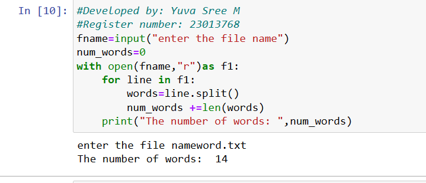

# copy-file
## AIM:
To write a python program for copying the contents from one file to another file.
## EQUIPEMENT'S REQUIRED: 
PC
Anaconda - Python 3.7
## ALGORITHM: 
### Step 1:Get the file name and location from the user

### Step 2: Give a new file name to create a copy of a file content
 
### Step 3: Read the find and close the file

### Step 4:  Now write the content in the new file

### Step 5: When done print "File Copied successfully"

### Step 6: End the program

## PROGRAM:
```

#Developed by: Yuva Sree M
#Register number: 23013768
fname=input("enter the file name")
num_words=0
with open(fname,"r")as f1:
    for line in f1:
        words=line.split()
        num_words +=len(words)
    print("The number of words: ",num_words)


```
### OUTPUT:




## RESULT:
Thus the program is written to copy the contents from one file to another file.